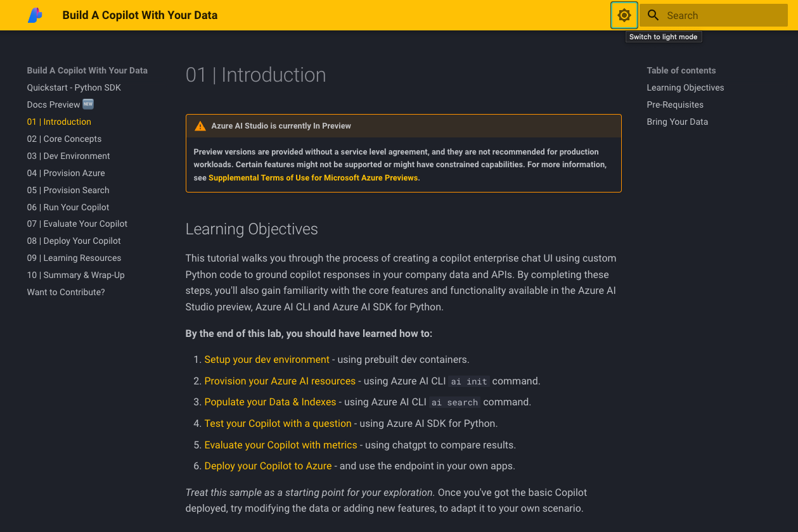
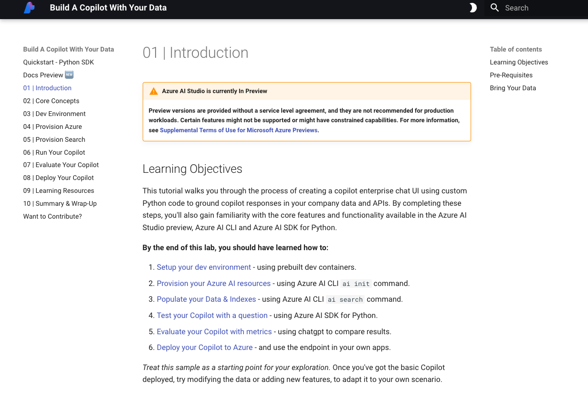
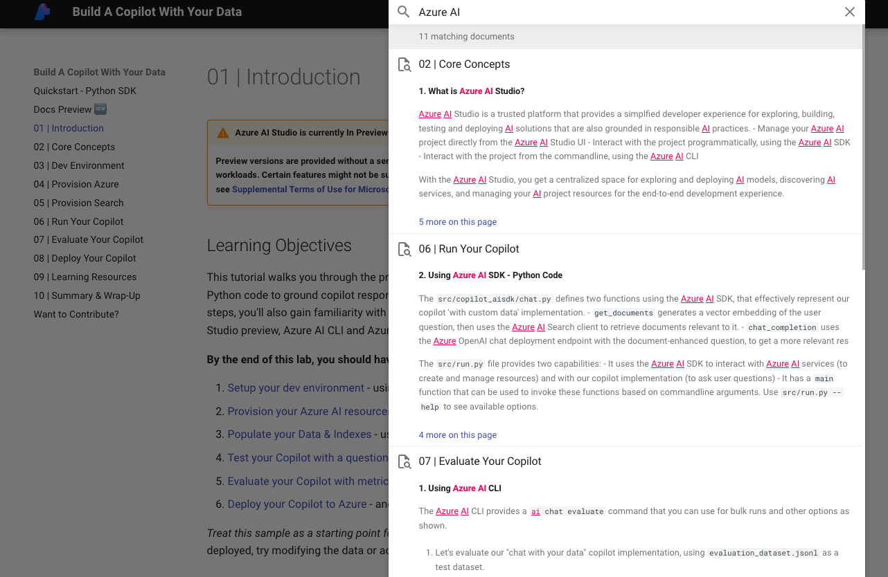

# Docs Preview 🆕

!!!info "This Feature Is Optional"
    The documentation for this tutorial is written completely in standard Markdown and should be easy to read and view right in your Visual Studio Code editor or GitHub repository browser page **with no additional tools required.** However, having docs in a separate preview tab from your code editor can help quick lookups. Preview also supports dark/light modes and integrated search capability.

## Material For MkDocs 

 To support this, we're using [Material For MkDocs](https://squidfunk.github.io/mkdocs-material/) to create a docs preview site. This involves 2 changes to repository (below) but does not change the markdown content or structure.
    
1. **`mkdocs.yml` in root folder.** Configures mkdocs features, look and feel. Currently looks for markdown files in _docs_ dir (default) with an _index.md_ for the homepage.
1. **`mkdocs-material` in requirements.txt** Installs the required Python package to help you build and preview the site in your browser on-demand.

We are however using some enhanced-Markdown capabilities from MkDocs like [**Admonitions**](https://squidfunk.github.io/mkdocs-material/reference/admonitions/?h=adm) (see the example box at the top of this page) that can help higlight key sections or context.

## Verify Installation

1. First check if you have `mkdocs` installed successfully in your environment, with this command. It should print out a valid version if installed.

    ```bash 
    mkdocs --version
    ```

1. If not installed, install it now with pip as shown, then check again to see if installed.

    ```bash 
    pip install mkdocs-material
    ```

## Launch Preview

Now, preview docs by using the following command in a terminal, from the root folder.

```bash 
mkdocs serve
```

The home page should look like this. The theme supports a dark/light mode toggle so you can switch between the two options below.

!!!info "DOCS PREVIEW | DARK MODE"

    

!!!info "DOCS PREVIEW | LIGHT  MODE"

    

## Search Docs

You should also be able to search the docs directly from the preview page as shown.

!!!info "DOCS SEARCH | LIGHT  MODE"

    
